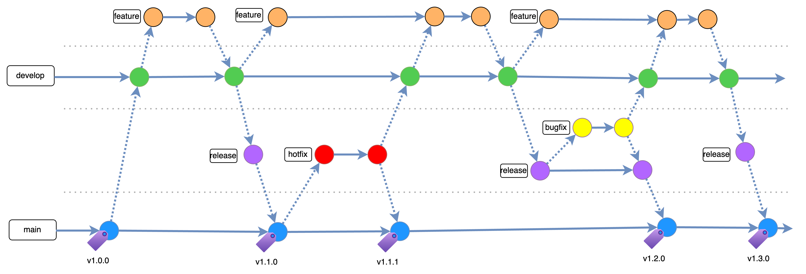
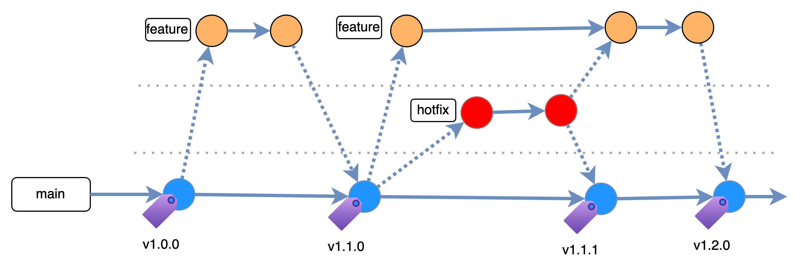

# Branching Strategies

## Git Branching Strategy for Larger Repositories
This strategy is designed for larger projects that have frequent changes and involve multiple developers working in parallel. The goal is to maintain a stable main code base while allowing for continuous integration and development.

### Long-Lived Branches
#### Main Branch

* **Purpose**: The main production code base.
* **Description**: This branch always reflects the latest stable release. All major releases are tagged in this branch.
* **Lifecycle**: Long-lived.
* **Merge Policy**: Only code that has passed thorough testing and review is merged into the `main` branch.

#### Develop Branch

* **Purpose**: The integration branch for features.
* **Description**: This branch contains the latest delivered development changes intended for the next release.
* **Lifecycle**: Long-lived.
* **Merge Policy**: Features and updates are integrated into this branch and it is periodically synced with `main`.

### Short-Lived Branches
#### Feature Branches

* **Purpose**: Branches where new features are developed.
* **Description**: Created off the `develop` branch, these branches are used to develop new features. They are named based on the feature being developed (e.g., `feature/login-page`).
* **Lifecycle**: Short-lived. Should be deleted once merged into `develop`.
* **Merge Policy**: Merged into `develop` after feature completion and testing.

#### Release Branches

* **Purpose**: Branches for preparing a new release.
* **Description**: Created off the `develop` branch when the codebase is stable and ready for a release. They are named based on the release version (e.g., `release/1.0.0`).
* **Lifecycle**: Short-lived. Should be deleted once merged into `main`.
* **Merge Policy**: Merged into `main` after release preparation, testing, and final adjustments.

#### Hotfix Branches

* **Purpose**: Branches for fixing production defects.
* **Description**: Created off the `main` branch to address critical issues found in production. They are named based on the issue being fixed (e.g., `hotfix/critical-bug`).
* **Lifecycle**: Short-lived. Should be deleted once merged into `main` and `develop`.
* **Merge Policy**: Merged into both `main` and `develop` after the hotfix is applied.

#### Bugfix Branches

* **Purpose**: Branches for fixing defects found during the release testing phase.
* **Description**: Created off the `release` branch when issues are found during testing. They are named based on the issue being fixed (e.g., `bugfix/issue123`).
* **Lifecycle**: Short-lived. Should be deleted once merged into both `release` and `develop`.
* **Merge Policy**: Merged into both `release` and `develop` after the bugfix is applied.

### Workflow Summary

* **Feature Development**: Develop new features in `feature` branches and merge them into `develop` upon completion.
* **Release Preparation**: When `develop` is stable and ready for a release, create a `release` branch for final testing and minor adjustments. Merge `release` branch into `main` after successful testing.
* **Production Fixes**: For critical issues in production, create a `hotfix` branch from `main`, fix the issue, and merge it into both `develop` and `main`.
* **Release Bug Fixes**: For issues found during release testing, create a `bugfix` branch from the respective `release` branch, fix the issue, and merge it back into both the `release` branch and `develop`.

### Example Workflow

#### Feature Branch

1. Create Feature Branch:
    * From `develop`: `feature/login-page`
    * Develop the feature.
2. Merge Feature Branch:
    * Merge `feature/login-page` into `develop`.
    * Delete `feature/login-page` branch after merging.

#### Release Branch

1. Create Release Branch:
    * From `develop`: `release/1.0.0`
    * Prepare and test the release.
2. Merge Release Branch:
    * Merge `release/1.0.0` into `main`.
    * Delete `release/1.0.0` branch after merging.

#### Hotfix Branch

1. Create Hotfix Branch:
    * From `main`: `hotfix/critical-bug`
    * Fix the issue.
2. Merge Hotfix Branch:
    * Merge `hotfix/critical-bug` into `main`.
    * Merge `hotfix/critical-bug` into `develop`.
    * Delete `hotfix/critical-bug` branch after merging.

#### Bugfix Branch

1. Create Bugfix Branch:
    * From `release/1.0.0`: `bugfix/issue123`
    * Fix the issue.
2. Merge Bugfix Branch:
    * Merge `bugfix/issue123` into `release/1.0.0`.
    * Merge `bugfix/issue123` into `develop`.
    * Delete `bugfix/issue123` branch after merging.

### Versioning Strategy

1. Major Version (X.0.0)
    * Incremented for large breaking changes.
    * Managed by the core development team.
2. Minor Version (0.X.0)
    * Incremented for new releases with new features or enhancements.
    * Managed by the core development team.
3. Patch Version (0.0.X)
    * Incremented for bug fixes, including those in hotfix and bugfix branches.
    * Managed by the core development team.

### Handling External Contributions
External contributors can also follow this strategy, typically creating feature branches off `main`:

1. **Branch Creation**: Contributors create feature branches off of `main`.
2. **Pull Requests**: Contributors submit pull requests (PRs) targeting the `main` branch.
3. **Review and Merge**: The development team reviews the PRs and merges them into `main`.
4. **Sync Develop**: Periodically sync `develop` with `main` to incorporate the latest changes from external contributions.

### External Contributor Workflow Summary
1. **Feature Development**: Contributors develop new features in feature branches and submit PRs targeting `main`.
2. **Review and Merge**: Development team reviews and merges PRs into `main`.
3. **Sync Develop**: Sync `develop` with `main` periodically to incorporate external contributions.

By following this strategy, we ensure a clear and efficient workflow for larger projects while still supporting essential development and maintenance activities.

___

## Simplified Git Branching Strategy for Smaller Repositories
This strategy is designed for smaller projects, such as library releases, that have infrequent changes and typically involve a single developer at a time. The goal is to maintain a simple workflow without the overhead of managing multiple long-lived branches.

### Long-Lived Branch
#### Main Branch

* **Purpose**: The main production code base.
* **Description**: This branch always reflects the latest stable release. All major releases are tagged in this branch.
* **Lifecycle**: Long-lived.
* **Merge Policy**: Only code that has passed thorough testing and review is merged into the main branch.

### Short-Lived Branches
#### Feature Branches

* **Purpose**: Branches where new features are developed.
* **Description**: Created off the `main` branch, these branches are used to develop new features. They are named based on the feature being developed (e.g., `feature/login-page`).
* **Lifecycle**: Short-lived. Should be deleted once merged into `main`.
* **Merge Policy**: Merged into `main` after feature completion and testing.

#### Hotfix Branches

* **Purpose**: Branches for fixing production defects.
* **Description**: Created off the `main` branch, these branches are used to address critical issues found in production. They are named based on the issue being fixed (e.g., `hotfix/critical-bug`).
* **Lifecycle**: Short-lived. Should be deleted once merged into `main`.
* **Merge Policy**: Merged into `main` after the hotfix is applied.

### Workflow Summary

* **Feature Development**: Develop new features in `feature` branches and merge them into `main` upon completion.
* **Production Fixes**: For critical issues in production, create a `hotfix` branch from `main`, fix the issue, and merge it back into `main`.

### Example Workflow
#### Feature Branch

1. Create Feature Branch:
    * From `main`: `feature/login-page`
    * Develop the feature.
2. Merge Feature Branch:
    * Merge `feature/login-page` into `main`.
    * Delete `feature/login-page` branch after merging.

#### Hotfix Branch
1. Create Hotfix Branch:
    * From `main`: `hotfix/critical-bug`
    * Fix the issue.
2. Merge Hotfix Branch:
    * Merge `hotfix/critical-bug` into `main`.
    * Delete `hotfix/critical-bug` branch after merging.

### Versioning Strategy

1. Major Version (X.0.0)
    * Incremented for large breaking changes.
    * Managed by the core development team.
2. Minor Version (0.X.0)
    * Incremented for new releases with new features or enhancements.
    * Managed by the core development team.
3. Patch Version (0.0.X)
    * Incremented for bug fixes, including those in hotfix branches.
    * Managed by the core development team.

### Handling External Contributions
External contributors can also use this simplified strategy:

1. **Branch Creation**: Contributors create feature branches off of `main`.
2. **Pull Requests**: Contributors submit pull requests (PRs) targeting the `main` branch.
3. **Review and Merge**: The development team reviews the PRs and merges them into `main`.

### External Contributor Workflow Summary
1. **Feature Development**: Contributors develop new features in `feature` branches and submit PRs targeting `main`.
2. **Review and Merge**: Development team reviews and merges PRs into `main`.

By following this strategy, we ensure a clear and efficient workflow for smaller projects while still supporting essential development and maintenance activities.